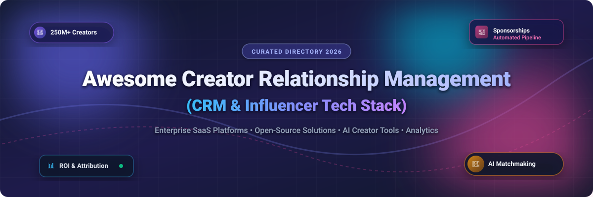

# Awesome Creator Relationship Management (CRM) 🚀

  
  
  
  

  

## 📌 Ecosystem Overview & Guide

A curated directory of **Creator Relationship Management (CRM)** software, **influencer marketing platforms**, and **open-source tools**. Designed for brands, digital agencies, influencer managers, and software developers building modern creator tech stacks.

> 💡 **Market Size & Structure Analysis (2026)**:  
> The Creator Economy market is estimated at **$250+ Billion** in 2026, with the dedicated Influencer Marketing & CRM software sector accounting for **~$15.2 Billion** globally. The market is **moderately fragmented**—while enterprise consolidators like Sprout Social (Tagger) and LTK command significant market share, hundreds of specialized platforms focus on niche verticals (e.g., Shopify e-commerce, micro-influencer discovery, AI outreach), preventing a single "winner-take-all" outcome.

---

## 📑 Table of Contents
- [🏢 SaaS/Hosted Platforms](#-saashosted-platforms)
- [🔓 Open-Source GitHub Projects](#-open-source-github-projects)
- [🤝 How to Contribute](#-how-to-contribute)
- [⚠️ Disclaimer](#-disclaimer)
- [📈 Star History](#-star-history)
- [💖 Support & Sponsorship](#-support--sponsorship)

---

## 🏢 SaaS/Hosted Platforms

Below is a breakdown of leading SaaS platforms for creator discovery, campaign tracking, and sponsorship management, sorted by **Company Size (Valuation / Revenue / Funding)** in descending order.

| Platform | Description | Pricing (Starting Tier) | Free Tier / Trial Limit | Company Size (Valuation / Revenue) |
| :--- | :--- | :--- | :--- | :--- |
| **[LTK](https://www.shopltk.com/)** 🛍️ | Creator commerce & affiliate platform connecting creators with brands for shoppable content. | Standard affiliate commission basis (~10-20% revenue share) | 30-day trial for brand accounts; Free creator application tier | **$2.0 Billion Valuation** ($315M raised; >$3B annual GMV) |
| **[Tagger (Sprout Social)](https://www.taggermedia.com/)** 🎯 | Enterprise creator intelligence & campaign execution platform. | Custom enterprise quotes (~$15,000/year minimum) | 14-day free trial (via Sprout Social suite trial) | **$140 Million Acquisition** (Acquired by Sprout Social) |
| **[CreatorIQ](https://www.creatoriq.com/)** 📊 | Enterprise-grade influencer marketing platform for large brands & agencies. | Starting at ~$30,000/year (~$2,500/month) | 14-day demo sandbox access upon enterprise request | **$56.9 Million Revenue** ($80.8M total funding) |
| **[Upfluence](https://www.upfluence.com/)** ⚡ | All-in-one influencer search, outreach, affiliate, and payment engine. | Starting at ~$318/month (billed annually) | 7-day free trial with profile search limits | **$35 Million Revenue** ($3.9M total funding) |
| **[Aspire](https://www.aspireiq.com/)** 🤝 | Creator marketing platform focusing on e-commerce product seeding & partnerships. | Starting at ~$500/month (annual commit) | 14-day free trial for self-serve discovery | **$26.4 Million Funding** (Creators drove >$52M affiliate sales in 2025) |
| **[GRIN](https://grin.co/)** 🛒 | E-commerce creator management CRM tailored for Shopify & WooCommerce brands. | Starting at ~$399/month (Lite self-serve tier) | 14-day trial for select self-serve tiers (demo required for Enterprise) | **$20 Million+ Revenue** ($110M+ total funding) |
| **[Modash](https://www.modash.io/)** 🔍 | Influencer discovery & fake follower analytics across 250M+ creators. | Starting at $199/month (billed annually) or $299/month | 14-day free trial (no credit card required; 10 profile lookups limit) | **$10 Million Revenue** (Self-serve bootstrap growth) |
| **[Julius](https://juliusworks.com/)** 📋 | Influencer database & campaign outreach tool with verified creator data. | Starting at ~$24,000/year (sales custom quote) | 7-day demo trial for agency requests | **$5.6 Million Revenue** (Acquired HYPR Brands) |
| **[Creator.co](https://creator.co/)** 🌟 | Self-serve & managed creator collaboration & automated campaign hub. | Starting at $199/month (Self-Serve) or $2,199/month (Managed) | 7-day free trial on Self-Serve plan (up to 5 creator outreach limit) | **$4.2 Million Revenue** ($1.93M total funding) |
| **[Influencity](https://influencity.com/)** 📈 | AI-driven creator audience demographics analysis & campaign management. | Starting at $318/month (Professional tier) | 7-day free trial (up to 5 profile analyses limit) | **$3.5 Million Revenue** (Private bootstrap growth) |

---

## 🔓 Open-Source GitHub Projects

Below is a curated list of open-source creator platforms, discovery engines, and adaptable CRM foundations, sorted by **GitHub Stars_Count** in descending order.

| Project & Repo | Description | GitHub_Stars | Tech Stack |
| :--- | :--- | :--- | :--- |
| **[Twenty](https://github.com/twentyhq/twenty)** ⚡ | The leading open-source enterprise CRM. Excellent foundation for building custom creator pipelines, partnership deals, and campaign tracking via custom objects. |  | TypeScript, React, PostgreSQL, NestJS |
| **[ERPNext](https://github.com/frappe/erpnext)** 📦 | Comprehensive open-source ERP & CRM system. Fully customizable for managing creator contract billing, commissions, and agency relationships. |  | Python, Frappe Framework, MariaDB |
| **[SuiteCRM](https://github.com/suitecrm/SuiteCRM)** 🏢 | Enterprise-grade open-source CRM alternative to Salesforce. Flexible contact workflow management adaptable for creator databases. |  | PHP, MariaDB, Angular |
| **[EspoCRM](https://github.com/espocrm/espocrm)** 📑 | Fast & flexible web-based open-source CRM application. Simple layout ideal for agency account managers tracking creator outreach. |  | PHP, MySQL, Backbone.js |
| **[Corteza](https://github.com/cortezaproject/corteza)** 🛠️ | Low-code open-source app builder & CRM platform. Easily configure custom creator onboarding forms and campaign dashboards. |  | Go, Vue.js, MySQL |
| **[InPactAI (AOSSIE-Org)](https://github.com/AOSSIE-Org/InPactAI)** 🤖 | AI-powered open-source platform connecting creators, brands, and agencies through data-driven sponsorship matchmaking and AI negotiation assistants. |  | React, FastAPI, Supabase, GenAI |
| **[Influencer Marketing Bot](https://github.com/wende12github/Influencer-Marketing-bot-with-Django)** 📊 | AI/ML-driven influencer marketing recommendations using Instagram API metrics and engagement calculation algorithms. |  | Python, Django, TensorFlow, Scikit-learn |
| **[InfluencerFlow AI](https://github.com/AmanGxpta/influencerflow-ai)** 🤖 | Comprehensive AI creator relationship management platform concept featuring AI email deal negotiation, contract generation, and campaign tracking. |  | Next.js, tRPC, Prisma, OpenAI GPT-4 |
| **[Influencer & Trends Discovery Tool](https://github.com/francisco-carcano/Influencers-and-Trends-Discovery-Tool-TikTok-Instagram-YouTube-API-Integration-)** 🔎 | Multi-platform discovery tool integrating TikTok, Instagram, and YouTube APIs for creator engagement extraction and analysis. |  | Python, Social APIs, OpenAI |

---

## 🤝 How to Contribute

We welcome contributions from developers, creator agency leads, and influencer marketers!

1. Fork this repository 🍴
2. Create a new feature branch (`git checkout -b feature/add-new-crm`)
3. Add or update entries in `README.md` following the table structures above.
4. Ensure factual accuracy, specific pricing starting points, and official website/repo links.
5. Open a Pull Request with a short explanation of your changes 🚀

---

## ⚠️ Disclaimer

- This list is **community-curated** for research and educational purposes and does not constitute endorsement.
- All brand names, logos, and product pricing remain the property of their respective owners.
- When managing creator data, always ensure compliance with local regulations (GDPR, CCPA) and platform Terms of Service.

---

## 📈 Star History

---

## 💖 Support & Sponsorship

Thank you for exploring and contributing to the **Awesome Creator Relationship Management** repository! 🌟

If you find this repository helpful for your projects, business research, or software development:
- ⭐️ **Star** this repository to help others discover it!
- 🍴 **Fork** it to keep a copy and contribute back.
- 📢 **Share** it with fellow developers, marketers, and creator economy enthusiasts!

☕ If you'd like to support the maintenance of this and other open-source projects, consider buying me a coffee:

